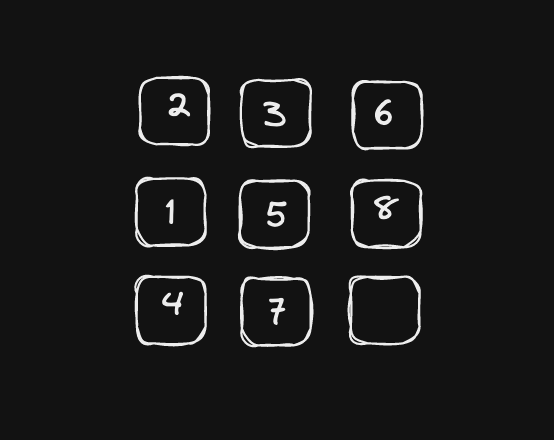
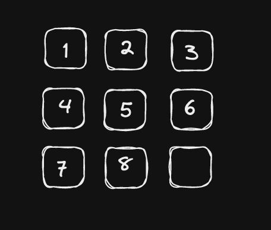

# Tile Game

 

## Description
- This tile game is played on a 3x3 board (support 4x4 in future?)
- The board will have 8 tiles marked 1-8 and then an empty tile somewhere on the board

## Goal
- To slide the board left, right, up, and down to get the board to be in this state where the numbers appear in ascending row major order

 

## Our Goal
- To solve this as a constraint satisfaction problem
- Fist solve with naive DFS
- Then solve with AC3 
- Need to define
    - State
    - Actions
    - Goal State

## State
- represented by a 2d matrix
- empty slot marked as 0

## Actions
- Up
    - is a valid move when the empty slot is in the <strong>top</strong> or <strong>middle</strong> <i>row</i>
- Down
    - is a valid move when the empty slot is in the <strong>bottom</strong> or <strong>middle</strong> <i>row</i>
- Left
    - is a valid move when the empty slot is in the <strong>left</strong> or <strong>middle</strong> <i>column</i>
- Right
    - is a valid move when the empty slot is in the <strong>right</strong> or <strong>middle</strong> <i>column</i>

